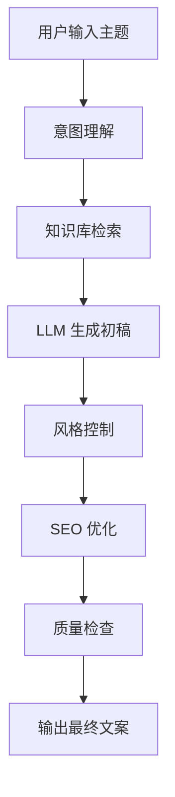

# 智能文案生成工作流

## 工作流描述

多步骤 AI 文案生成工作流，通过 Coze 平台搭建。

## 流程步骤



## 输入参数

| 参数 | 类型 | 说明 |
|------|------|------|
| topic | string | 文案主题 |
| copy_type | enum | 文案类型（营销/产品/活动） |
| style | enum | 风格偏好 |
| keywords | string[] | 目标关键词 |

## 输出格式

```json
{
  "title": "文案标题",
  "content": "生成的文案内容",
  "style": "应用风格",
  "tags": ["标签1", "标签2"],
  "generated_at": "2026-05-08T12:00:00"
}
```
